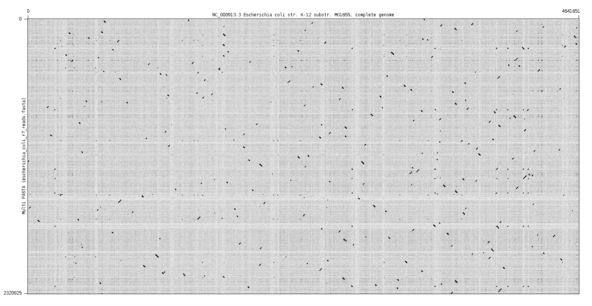
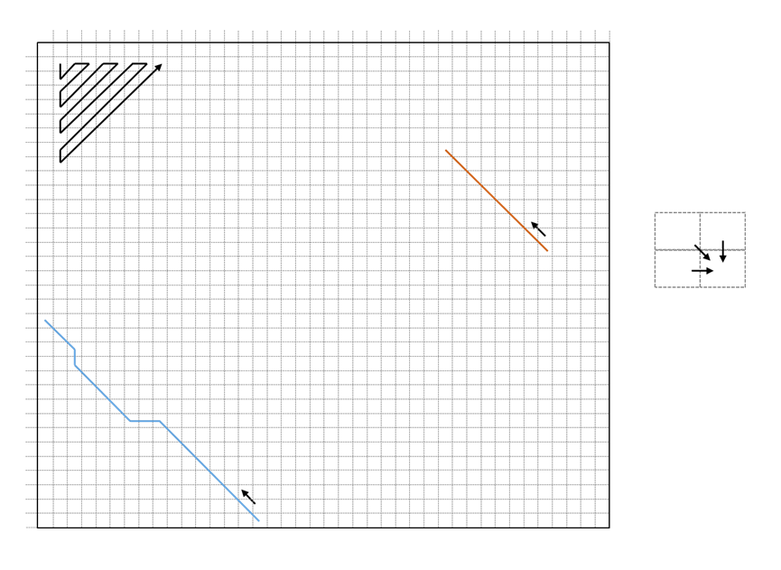

# BSc project (computer science - 2020/2021)

Software Design Project is a course held at University of Zagreb, Faculty of Electrical Engineering and Computing in the fifth semester of the undergraduate study. The main focus is to promote cooperation between students while solving specific problems. Under the supervision of professor Mile Šikić and assistant professor Krešimir Križanović, students will get familiar with C++, basics of compilation methods, version control, unit tests and continuous integration, and will be introduced to algorithms used in bioinformatics. This project will be executed in several steps, each with defined outcomes which are required for succeeding steps. Instructions and guidelines for the project will be written in this README file which will be updated through the semester.

## Preliminaries

Students are required to get through the following tutorials: [C++](http://www.cplusplus.com/doc/tutorial/), [GitHub](http://rogerdudler.github.io/git-guide/), [CMake](https://cmake.org/cmake/help/latest/guide/tutorial/index.html), [Googletest](https://github.com/google/googletest/blob/master/googletest/docs/primer.md) and [Travis CI](https://docs.travis-ci.com/user/getting-started/). While writing C++ code, we advise to follow the [Google C++ style guide](https://google.github.io/styleguide/cppguide.html).

Students will be assigned to one of five teams which are **blonde**, **blue**, **brown**, **orange**, **pink** and **white**. Each team will have a separate branch and only team members will have write permission. Although, additional branches can be created if needed, but should have names starting with the team name (e.g. `blonde_feature_one`).

## Objective

At the end of the project, students will have implemented several libraries that enable placement and description of similarity between a large amount of substrings (of various sizes) and a much longer string from which they all originate. The goal is to create a single program out of those libraries in order to map long erroneous fragments obtained via third generation sequencing technologies to a reference genome, which has various use cases in bioinformatics. A visual example can be seen bellow.



## Setup

Each team's main branch should be up to date with this README. The project setup consists of creating a C++ program and naming it in form of `<team name>_mapper` (e.g. `blonde_mapper`) with `cmake`. It has to accept two files as floating arguments and enable options `-h` (`--help`) and `--version`, which are used for the help and version messages (following [SemVer](https://semver.org/)), respectively. Suggested argument parser to include is `optarg`, but this feature can also be implemented independently.

The first file will contain a reference genome in [FASTA](https://en.wikipedia.org/wiki/FASTA_format) format, while the second file will contain a set of fragments in either FASTA or [FASTQ](https://en.wikipedia.org/wiki/FASTQ_format) format. The files need to be parsed and stored in memory, and some statistics have to be outputted to `stderr`, which includes names of sequences in the reference file and their lengths, number of sequences in the fragments file, their average length, N50 length, minimal and maximal length, etc. There is no need to implement a parser, you can add [bioparser](https://github.com/rvaser/bioparser) to the project as a submodule via `git` and integrate it with `cmake`. It supports several bioinformatics formats where files can also be compressed with `gzip`.

Sample program runs, after the setup step is completed, can be seen bellow:

```bash
blonde_mapper GCF_000005845.2_ASM584v2_genomic.fna MAP006-1_2D_pass.fasta
<basic statistics of input files>
```

```bash
blonde_mapper -h
<appropriate message describing supported arguments>
```

```bash
blonde_mapper --version
v0.1.0
```

## Data

The first version of the mapper will be tested on an Oxford Nanopore Technologies data set obtained by sequencing the Escherichia coli K-12 substr. MG1655 genome. The data set is available from Loman Labs [here](http://lab.loman.net/2015/09/24/first-sqk-map-006-experiment/) (download one or both of MAP-006-1 and MAP-006-2 FASTA files), while the reference genome is available from NCBI [here](https://ftp.ncbi.nlm.nih.gov/genomes/all/GCF/000/005/845/GCF_000005845.2_ASM584v2/GCF_000005845.2_ASM584v2_genomic.fna.gz).


## Alignment

Sequence alignment is a series of transformations which describes how to obtain one sequence from the other. The main use case in bioinformatics is to find similar regions between DNA chains, RNA chains or proteins in order to infer evolutionary and functional relationships. Alignments can be found using dynamic programming, an approach that solves a complicated problem by breaking it into smaller subproblems in a recursive manner. Results of the subproblems are stored and used to reconstruct the final solution. Dynamic programming algorithms for sequence alignment use a `(n + 1) * (m + 1)` matrix, where `n` and `m` are lengths of sequences that are being aligned. Each cell `(i, j)` of the matrix stores the best alignment score between substrings `[0, i]` and `[0, j]`, which can be calculated as the maximal score between the value of the upper cell plus the deletion cost, the value of the upper left cell plus the match or mismatch cost, and the value of the left cell plus the insertion cost. Once the matrix is completely filled, the optimal alignment can be found by backtracking from the best scoring cell of the matrix. A visual example is shown bellow.



There are different versions of pairwise alignment algorithms, the Needleman-Wunsch algorithm for global alignment, the Smith-Waterman algorithm for local alignment and semi-global algorithms used for suffix-prefix and prefix-suffix alignments. The main differences between them are in the initialization step and the place from which the backtrack procedure can start.

Students have to create a library which implements all three alignment algorithms. The library should be named in form of `<team name>_alignment` (e.g. `blonde_alignment`) and should have its own namespace called after the team (e.g. `blonde`). The library has to be created with the same `CMakeLists.txt` file as the mapper, and eventually be linked to it. The implementation has no requirements (it can be just one function or through a class) but the alignment function should have the following prototype:

```cpp
int Align(
    const char* query, unsigned int query_len,
    const char* target, unsigned int target_len,
    AlignmentType type,
    int match,
    int mismatch,
    int gap,
    std::string* cigar = nullptr,
    unsigned int* target_begin = nullptr);
```

where the return value is the alignment score, `AlignmentType` is an `enum class` determining the alignment type (i.e. global, local or semi-global), while `match`, `mismatch` and `gap` represent match, mismatch and insertion/deletion cost, respectively. There are also two optional arguments in which the function stores the [CIGAR](https://samtools.github.io/hts-specs/SAMv1.pdf) string of the alignment and the alignment beginning position on the target sequence, if they are not nullptr.

Once the library is completed, it has to be included in the mapper by adding input arguments for the alignment type (`-a`), and match (`-m`), mismatch (`-n`) and gap (`-g`) costs. Afterwards, two random sequences from the second input file, with lengths not exceeding 5000 base pairs, need to be aligned and the result reported.

A good read for this part of the project is the second chapter of the Bioinformatics course held at University of Zagreb, Faculty of Electrical Engineering and Computing (located [here](https://www.fer.unizg.hr/_download/repository/bioinformatika_skripta_v1.2.pdf)).

## Unit tests and continuous integration

The alignment library, and all other code components to follow, should have a set of unit tests (using googletest) which are automatically compiled and run after each commit to the team's main branch (via Travis CI). Googletest should be included to the project via CMake command `find_package(GTest REQUIRED)`, and not as a submodule. Travis CI machines do not have Googletest preinstalled, so you have to manually do it as part of the `before_install:` clause in `.travis.yml` file. In addition, configure Travis to run unit tests on Ubuntu and macOS, with both gcc and clang compilers. A success/failure [badge](https://docs.travis-ci.com/user/status-images/) for the integration should be placed in this README.

## Minimizers

The next step is to implement a library that for any DNA/RNA sequence returns its set of minimizers, which are specific substrings of defined length *k* (often called *k*-mers). As alignment algorithms have quadratic time complexity, *k*-mer indexing is often used for fast detection of similar regions between two sequences (or one vs many) prior the alignment. However, collecting all *k*-mers can have a big impact on computational resources (both memory and execution time), especially choosing those that are quite frequent in the target sequence set. Considering only a subset of *k*-mers can alleviate the whole process while keeping reasonable levels of sensitivity. One such method is to use lexicographically smallest *k*-mers called minimizers which are described [here](https://academic.oup.com/bioinformatics/article/20/18/3363/202143).

The library should be named in a form of `<team name>_minimizers` (e.g. `blonde_minimizers`) and should share its namespace with the alignment library (e.g. `blonde`). Other constraints apply as well, it has to be created with the same `CMakeLists.txt`, it has to be linked to the mapper, and have its own unit tests which are run via TravisCI. The implementation has no requirements (it can be just one function or through a class) but the function for obtaining minimizers should have the following prototype:

```cpp
std::vector<std::tuple<unsigned int, unsigned int, bool>> Minimize(
    const char* sequence, unsigned int sequence_len,
    unsigned int kmer_len,
    unsigned int window_len);
```

where the return value is the list of found minimizers (first `unsigned int` of tuple), their positions in the sequence (second `unsigned int` of tuple) and their origin (whether they are located on the original strand (`true` in tuple) or the [reverse complement](https://en.wikipedia.org/wiki/Complementarity_(molecular_biology)) (`false` in tuple)), while parameters `kmer_len` and `window_len` are self explanatory (check the provided paper).

Once the library is finished, it has to be used to find minimizers of all sequences in the first input file, and then in the second. The mapper has to print the number of distinct minimizers, fraction of singletons, and the number of occurrences of the most frequent minimizer when the top `f` frequent minimizers are **not** taken in account (add optional arguments for setting `k`, `w` and `f` to the mapper). Default values for `(k, w, f)` should be `(15, 5, 0.001)`.

## Mapper

The final step is to align each of the inputed fragments to the given reference genome, with the help of the alignment and the minimizer libraries. First, it is necessary to create a minimizer index from the reference genome, which will store all positions and origins for each distinct minimizer found in the reference (too frequent minimizers should be ignored, controlled by parameter `f`). Next, all minimizers of a fragment are to be searched against the reference index to find matches. From the list of all matches for a pair of `(fragment, reference)`, the longest linear chain should represent the best candidate for a good alignment between the pair. That region can be obtained in quasilinear time by solving the longest increasing subsequence problem on the list of minimizer matches. Afterwards, the alignment procedure can be invoked only on the found regions (`[q_begin, q_end]` and `[t_begin, t_end]`).

The mapper should print the found regions in [PAF](https://github.com/lh3/miniasm/blob/master/PAF.md) format to stdout. The CIGAR strings of the alignment should be included only if argument `c` is used at runtime. They ought to be stored in the 13th collumn in format `cg:Z:<CIGAR>`. In addition, the mapper should be parallelized with optional number of threads (determined over argument `t`). Parallelization can be done via [OpenMP](https://www.openmp.org/) or [thread_pool](https://github.com/rvaser/thread_pool).

## Disclaimer

Laboratory for Bioinformatics and Computational Biology cannot be held responsible for any copyright infringement caused by actions of students contributing to any of its repositories. Any case of copyright infringement will be promptly removed from the affected repositories and reported to appropriate faculty organs.
